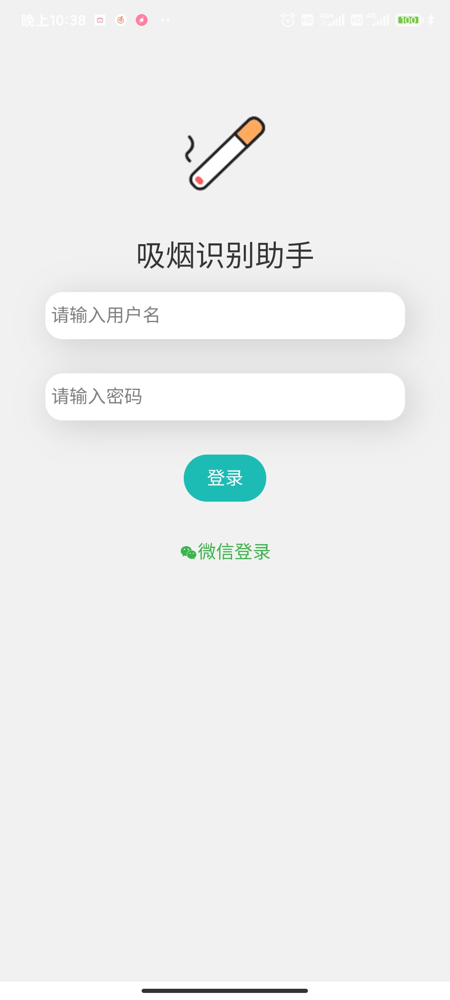
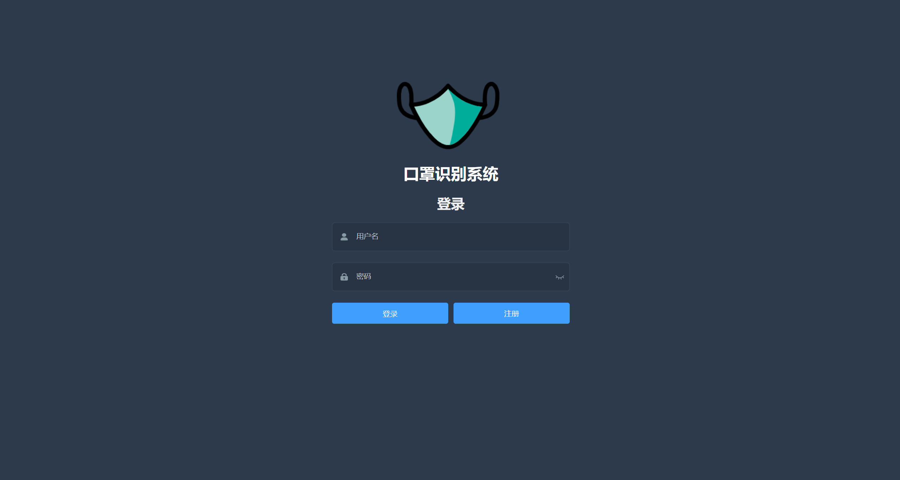
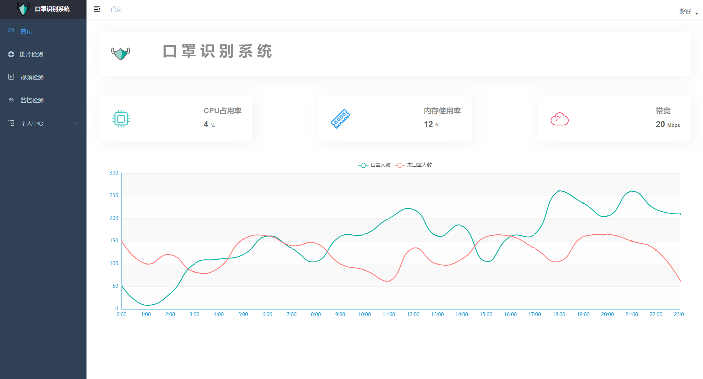

# 机器视觉相关的完整项目/系统
[](https://github.com/ceresOPA)  [](https://space.bilibili.com/510005777)<br/>
本人本科比赛期间开发的机器视觉相关的系统，包括模型训练代码(机器学习代码参考众多大牛实现)，同时还含有Web端(Vue)、小程序(Uniapp)、以及后端(FastApi)完整代码

## 小程序端

采用HBuilderX开发工具进行开发，基于Uniapp框架实现。小程序端的测试运行只需要直接将代码导入HBuilderX（内置小程序开发的各类插件）中即可进行实时的调试与开发。
- 界面展示




## Web端

Web端基于Vue-admin-temple进行开发，**注意node环境最好采用14.15.4版本，高版本可能会出现环境问题**<br />
1. 在完成node环境的配置后，进入mask-web目录下，打开cmd，执行下面的命令
```
//下载模块到本地
npm install
```
2. 在当前目录(./mask-web)下，执行下面的命令可直接启动项目(默认81端口)
```
npm run serve
```
- 界面展示




## 服务端

服务端接口采用FastApi开发，其中mask-server使用到YOLOv5，oldPhotoRectify-server使用到Bringing-Old-Photos-Back-to-Life和colorization两个开源项目（链接可点击下方**涉及开源项目**进行跳转）。由于模型大小较大，上传代码未包含训练得到的模型。<br />
常用python库已在requirement.txt中给出，可通过执行以下命令进行安装（注：由于本项目主要为本人大二期间完成，因此大部分库的版本较早）
```
pip install -r requirement.txt
```
服务端代码的运行，可直接进入server目录下，执行下面命令运行（注：上传代码中未包含模型，因此无法完成检测，但包含完整代码，且服务端可正常运行）
```
python main.py
```

## tips：
###### 这里的三套系统（口罩佩戴识别系统、吸烟检测系统、残旧照片修复系统）的小程序端与Web端的代码除具体的接口调用外，其他代码均一致，因此这里仅上传口罩佩戴识别系统的小程序端与Web端代码。
###### 因此，**有兴趣的朋友也可以使用本小程序端与Web端的代码进行二次开发，帮助不熟悉前端与小程序开发的朋友快速实现完整的系统**。

---

## 涉及开源项目：
- [](https://github.com/ultralytics/yolov5)
- [](https://github.com/microsoft/Bringing-Old-Photos-Back-to-Life)
- [](https://github.com/richzhang/colorization)
- [](https://github.com/PanJiaChen/vue-admin-template)

